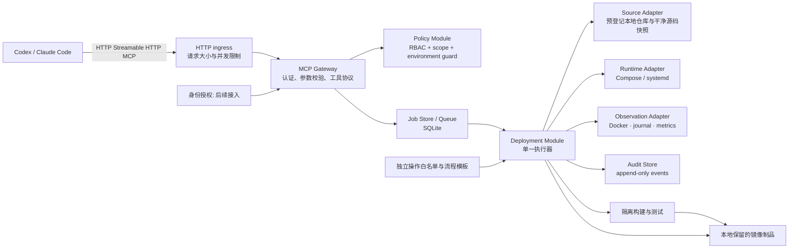
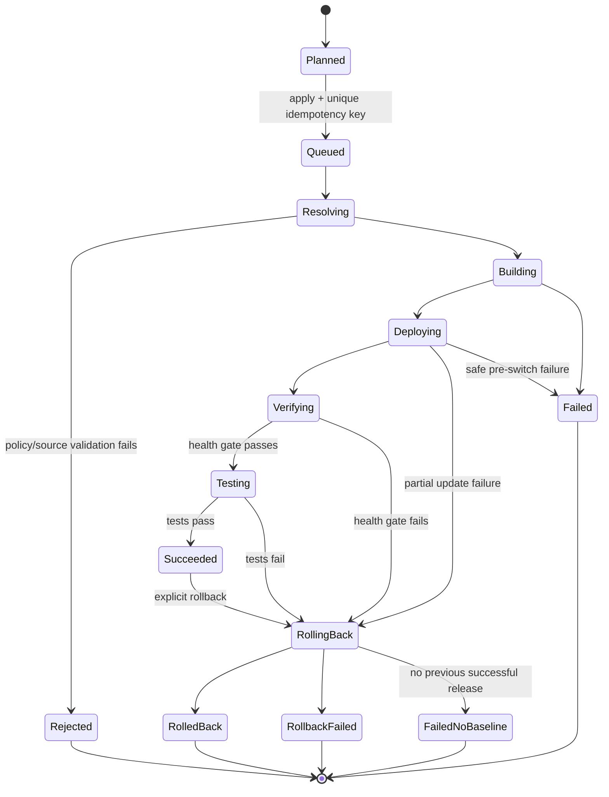

# Drawbridge：面向编程智能体的远程部署与运行观测 MCP

**Drawbridge — MCP bridge for server operations and deployment.**

面向 AI 编程工具的服务器操作与部署桥梁。Drawbridge 意为“吊桥”，连接编程智能体与
目标服务器，通过操作白名单和流程模板控制可执行的动作。它定位为轻量代理工具，
帮助完成部署、观测与验证闭环。项目名使用 `drawbridge`，文档与产品展示使用 `Drawbridge`。

## 1. 结论与设计决策

建设一个部署在目标服务器上的 **Drawbridge**。它通过 **HTTP** 暴露一个
Streamable HTTP MCP 端点；监听地址由部署配置决定，并以客户端源 IP 白名单
（192.168.0.0/16）限制访问来源，让 Codex、Claude Code 等 MCP
客户端能够：

- 获取服务器与应用的受限运行快照；
- 查询已经脱敏、分页的应用日志；
- 将**登记过的仓库**的指定 Git ref 解析为不可变 commit；
- 对测试环境执行可追踪的部署、冒烟测试和回滚；
- 通过服务器内置流程模板完成构建、部署、验证与回滚，不依赖外部 CI/CD。

最重要的决定：**不提供任意 Shell、任意 Docker 命令、任意 Git URL 或任意
文件路径作为 MCP 工具。** MCP 调用者包含语言模型；把这些能力直接暴露，等价于
给模型一个高权限远程执行入口。Drawbridge 的外部 interface 是一小组“任务型”工具，
把 Git、容器编排、健康检查、日志分页、授权和审计隐藏在深的 Deployment Module 中。

对于“把刚由 Codex/Claude Code 修改的代码尽快部署测试”，推荐的主路径是：

1. 智能体在开发机修改代码并推送一个临时分支或 commit；
2. 调用 `ops_release_plan`，服务器只从 app registry 中匹配的 `origin` 拉取该 ref；
3. 调用 `ops_release_apply` 将该不可变 SHA 部署至 staging；
4. 查询模板自带的测试结果、`ops_status` 和 `ops_logs`，必要时额外运行登记测试；
5. AI 根据验证证据调整代码，生成新 commit，再次触发同一流程模板。

服务器负责步骤排序、超时、锁与失败恢复；AI 触发流程并解释结果。每次发布冻结完整
SHA，不发布未提交工作区。预先克隆的服务器仓库可登记后复用，支持 fetch 后解析 ref
或直接选择本地已提交 SHA。远程源码编辑和通用终端不属于首版 interface。

## 2. 目标、边界与假设

### 目标

- 统一给 Codex 和 Claude Code 一个远程 MCP endpoint；
- 覆盖 Linux 主机、Docker Compose 应用的状态、日志与部署；
- 每次变更可定位到请求、工具、应用、commit、镜像、时间和结果；身份后续接入；
- 失败时停止并尝试恢复上一成功 release，如实记录恢复失败；
- 首个版本能在单台 staging 服务器上可靠运行，后续可扩展到多环境。

### 非目标

- 不是通用 SSH 跳板机、终端代理或任意代码执行平台；
- 不建设通用 CI 平台，但承担当前应用的固定构建、部署和测试流水线；
- 不存储业务密钥，也不让 MCP 客户端读取 `.env`、容器环境变量或完整日志归档；
- 第一阶段不支持 Kubernetes、多租户、数据库迁移或数据恢复。

### 设计假设

- 目标服务器为 Linux，应用初期使用 Docker Compose；
- GitHub/GitLab 仓库由操作者预先克隆至服务器，登记固定 repo_path；无需镜像仓库；
- 使用 HTTP，监听地址和端口可配置；首版由 Gateway 实施客户端源 IP 白名单，仅允许
  192.168.0.0/16 网段访问；完整身份权限体系与审批后续决定，不作为首版前提；
- 当前不涉及数据库操作；回滚范围限于应用镜像与部署配置。

## 3. 总体架构



### 部署形态

- `drawbridge-gateway`：绑定配置的 HTTP 地址（例如 `http://192.168.18.7:8787/mcp`）；
  首版不依赖反向代理、证书或 HTTPS；按配置的客户端源 IP 白名单（默认
  192.168.0.0/16）拒绝白名单外的来源。
- Gateway 本身为无状态 Python Module，采用官方 MCP Python SDK 的
  Streamable HTTP transport；只做认证、校验、策略判断和排队，**不**持有 Docker
  socket 或 Git 凭据。
- `drawbridge-runner`：同机 systemd 服务，消费 job。它是唯一可接触部署目录、受控
  本地 Git 仓库与运行时的 deployment principal。
- SQLite：本地文件 `/var/lib/drawbridge/state.db` 保存配置快照、release、job、步骤、
  幂等键和事件；无需独立数据库服务。应用注册表权威来源仍为 YAML。
- 可选 Prometheus：Drawbridge 先读取 node_exporter/cAdvisor 或应用 `/metrics` 的
  聚合结果。它不是 Prometheus 的替代品。

不要把 Gateway 加进 `docker` group。Docker socket 等价于主机高权限；若 staging 的
Runner 必须操作 Docker，可让**仅 Runner**持有该权限，并将它视为受控的部署主体。
Runner 属于可信计算基础，不承诺其无法读取主机 secret。构建/测试代码不能在 Runner
账号下直接执行；使用独立隔离构建环境（例如 rootless BuildKit）与测试容器，不提供
部署凭据或宿主机 Docker socket，并限制资源、磁盘、网络和时间。镜像通过受控制品
导入步骤进入目标 Engine。容器隔离不等于虚拟机级隔离。

## 4. 深模块与内部 seam

外部只有一个 `Drawbridge MCP Module`；调用方不需要知道 Docker、Git worktree、
数据库或 systemd 的细节。其内部保留以下可替换 seam：

| Module | 对上层的 interface | 可替换 adapter | 责任 |
|---|---|---|---|
| Policy Module | `authorize(identity, action, target)` | 本地 RBAC，后续 OPA | scope、环境和应用级授权 |
| Source Module | `resolve(app, ref) -> commit` | 预登记本地 Git 仓库 | 固定 origin、ref 校验、干净源码快照 |
| Runtime Module | `inspect/deploy/restart/rollback/logs` | Compose，systemd，后续 Kubernetes | 将运行时细节收敛在服务器端 |
| Observation Module | `snapshot/queryLogs` | Docker+journal，Prometheus/Loki | 限制数据量、红线脱敏与 cursor |
| Release Module | `plan/apply/status/rollback` | 使用上述 modules | 状态机、幂等、锁、健康门禁与审计 |

Runtime Module 首版可以只有 Compose adapter；在真正需要 Kubernetes 前不引入一层
“通用基础设施 interface”。两个以上 adapter 才证明这条 seam 有现实价值。

## 5. MCP 外部 interface

动态数据通过 tools 返回；resources 只暴露低频、无敏感信息的说明与清单，例如
`drawbridge://environments`、`drawbridge://apps`、`drawbridge://runbook/{app}`。

| 工具 | 权限 | 输入（均有 JSON Schema） | 结果 |
|---|---|---|---|
| `ops_status` | `ops:read` | `environment`, 可选 `app` | CPU/内存/磁盘、服务健康、当前 release、关键端口；不含进程命令行和 secrets |
| `ops_logs` | `logs:read` | `environment`, `app`, 可选 `service`, `since`, `query`, `cursor`, `limit<=200` | 脱敏日志行、下一 cursor、截断标记 |
| `ops_release_plan` | 后续 `deploy:plan` | `environment`, `app`, `source_mode=fetch/local`, `git_ref`, `workflow` | 完整 SHA、基线、配置摘要、影响服务、步骤、plan_id 和过期时间 |
| `ops_release_apply` | 后续部署权限 | `plan_id`, `idempotency_key` | 异步 `job_id`；不会接受命令字符串 |
| `ops_release_status` | `ops:read` | `job_id` 或 `release_id` | 阶段、结构化进度、健康结果、可安全展示的错误 |
| `ops_test` | 后续 `test:run` | `release_id`, `suite`（登记名称）, `idempotency_key` | 测试 job 与证据；核实目标版本并取得环境锁 |
| `ops_service_restart` | `runtime:restart` | `environment`, `app`, `service`（登记名称）, `reason`, `idempotency_key` | 重启当前 release 的已登记服务，随后执行对应健康检查 |
| `ops_release_rollback` | `deploy:rollback` | `environment`, `app`, `release_id`, `reason`, `idempotency_key` | 回滚 job；只能选择历史成功 release |

新增核心工具：

| 工具 | 输入 | 结果 |
|---|---|---|
| `ops_catalog` | 可选 app | 可用操作、模板与参数 schema |
| `ops_operation_run` | operation、app/environment、parameters、写操作的 idempotency_key | 公开操作的受限结果或 job_id |
| `ops_workflow_run` | workflow、plan_id 或模板声明的目标参数、idempotency_key | 持久化异步 job_id |

上表权限列是后续授权接入点，不是首版前提。`ops_release_apply` 是 deploy_verify 模板的
便捷入口，与 ops_workflow_run 使用同一执行器。部署模板必须引用 plan，不允许请求
覆盖 SHA、步骤、命令、路径或环境变量。客户端断开不取消 job，AI 查询 status 获取结果。

`git_ref` 不是 URL；仓库由 app ID 解析，ref 必须通过注册表的正则及 Git 格式校验。
完整 SHA 还必须可从允许的分支/tag 到达，不能仅检查十六进制格式就允许部署。
工具结果的日志与错误须以
`next_cursor` 分页，单次限制在约 200 行/256 KiB，避免撑爆模型上下文，也降低 secret
泄露面。

### 明确拒绝的工具

- `shell(command)`、`ssh(host, command)`、`docker(args)`、`git(url, ref)`；
- 读取任意路径、列出环境变量、下载整个日志文件、端口转发；
- `deploy(branch)` 这种没有先解析并展示 commit/执行计划的捷径；
- 以“测试”为名执行调用者提供的测试命令。测试只能选择已登记的 test suite。

上述限制针对请求提供任意命令字符串，不禁止服务器执行已登记、独立维护的 shell
脚本。项目内诊断通过以下操作进入，不开放通用远程终端。

### 项目配置检查与固定 shell 脚本

这些操作通过 ops_operation_run 调用，由 ops_catalog 展示参数 schema：

| 操作 | 输入 | 行为 |
|---|---|---|
| `config_read` | app、file（登记别名） | 读取允许的配置文件，限制大小、隐藏登记敏感字段并标记截断 |
| `config_validate` | app、validator（登记名称） | 在固定项目目录执行登记的语法/语义检查，返回结构化结果 |
| `project_list` | app、subdir（允许的项目内相对路径） | 分页列出允许目录，不返回任意主机路径或递归导出源码 |
| `check_project_config` | app、登记的受限参数 | 运行管理员维护的固定 shell 诊断脚本 |

cwd 由 app 配置解析，效果相当于先进入项目目录再检查，不需要 AI 传入 cd 或命令组合。
config_read 默认只读已提交项目配置，不读取 .env、凭据、secret 或容器环境变量。
检查现场配置时另登记明确文件别名和允许展示字段，不将“所有项目文件”作为默认范围。
目录/文件解析拒绝绝对路径、路径穿越和逃逸符号链接；打开文件时也检查实际归属，
避免只校验字符串后跟随变化的链接。只处理普通文件，不读取设备、FIFO 或无限流。

```yaml
operations:
  check_project_config:
    executable: /bin/bash
    argv: ["--noprofile", "--norc", "/etc/drawbridge/scripts/check_project_config.sh"]
    cwd_from: app.repo_path
    timeout_seconds: 15
    max_output_bytes: 65536
    public: true
    access: read
    execution_profile: project_diagnostic
```

脚本位于业务仓库外，由管理员维护、执行账号只读，纳入配置版本摘要。不使用 bash -c
接收请求字符串，不把参数拼进脚本源码，不使用 eval；参数以位置参数传入，脚本内部
正确引用并再次验证。清理 BASH_ENV、ENV 等启动环境变量，不加载用户 shell 配置。
脚本可以使用固定管道等 shell 语法，但不能以高权限 source/执行业务仓库中的可修改脚本。

execution_profile:project_diagnostic 使用独立低权限账号或隔离容器，项目只读挂载，
无 Docker socket、部署凭据和默认网络权限，写入仅限专用临时目录。access:read 只是
声明，不自动提供只读保障；权限和挂载需实际实施。会运行插件或项目代码的校验器按
不可信测试代码隔离，不能因为名字叫“配置检查”就放在高权限 Runner 内执行。
诊断结果记录目标为工作区还是具体 release/SHA，避免把工作区检查误当作线上验证。

### 受控执行器如何拉代码、重启和测试

命令由 Runner 执行，模型只能选择登记操作和允许变化的参数，不能选择任意二进制、
工作目录或权限。其实现对应关系：

| MCP 调用 | Runner 实际执行的受控工作 | 约束 |
|---|---|---|
| `ops_release_plan(... git_ref ...)` | 在登记本地仓库 fetch 固定 origin（local 模式跳过），解析完整 SHA | 路径与 origin 固定，ref 格式和范围均校验 |
| `ops_release_apply(plan_id)` | 从干净 worktree/已验证镜像生成 release，并执行固定的 Compose 更新 | `plan_id` 已绑定 app、SHA/digest 和配置版本；同一 app 有排它锁 |
| `ops_service_restart(app, service)` | 由 Compose adapter 重启注册表指定 service，随后运行该 service 的 health check | `service` 只能是 `restartable_services` 中的名称；不能附加 Compose 参数 |
| `ops_test(release_id, suite)` | 在受控 test runner 中运行与 `suite` 绑定的 argv | 不接收 `command`、环境变量或路径；有 timeout、CPU/内存、网络和权限限制 |

测试确实会执行刚拉下来的应用代码，因此 staging test runner 必须是隔离容器或隔离
低权限账号：只读 source、没有 Docker socket、没有生产密钥、受限网络出口、资源上限和
超时。构建也适用同类隔离；没有外部 CI 的情况下由服务器模板完成构建与验证。

### 操作白名单与流程模板

使用 `/etc/drawbridge/apps.yaml`、`operations.yaml`、`workflows.yaml` 三份独立配置。
管理员维护，Gateway/Runner 仅可读取，业务代码及 MCP 请求不能修改。启动时校验 schema、
操作引用、参数和流程结构。首版仅支持顺序步骤、失败停止与固定恢复逻辑。

```yaml
operations:
  git_status:
    executable: /usr/bin/git
    argv: [status, --short]
    cwd_from: app.repo_path
    timeout_seconds: 10
    max_output_bytes: 65536
    public: true
    access: read
  process_list:
    executable: /usr/bin/ps
    argv: [-eo, "pid,ppid,user,comm,%cpu,%mem"]
    timeout_seconds: 10
    max_output_bytes: 65536
    public: true
    access: read
  git_log:
    executable: /usr/bin/git
    argv: [log, "--max-count={count}", "{ref}", "--"]
    cwd_from: app.repo_path
    parameters:
      count: {type: integer, minimum: 1, maximum: 100}
      ref:
        type: string
        max_length: 200
        pattern: '^refs/heads/(agent/[A-Za-z0-9_-]+|main)$'
        validate: git_check_ref_format
    timeout_seconds: 10
    max_output_bytes: 65536
    public: true
    access: read
  compose_deploy:
    handler: compose_deploy
    timeout_seconds: 120
    public: false
    access: runtime_write
workflows:
  deploy_verify:
    requires_plan: true
    lock: app_environment
    timeout_seconds: 1800
    recovery_timeout_seconds: 300
    steps:
      - {id: preflight, operation: release_preflight}
      - {id: source, operation: source_snapshot}
      - {id: build, operation: image_build}
      - {id: deploy, operation: compose_deploy}
      - {id: health, operation: health_check}
      - {id: test, operation: test_suite, parameters: {suite: smoke}}
      - {id: finalize, operation: release_finalize}
    on_failure:
      before_runtime_change: stop
      after_runtime_change: restore_previous_release
```

示例其余操作均需登记；复杂步骤用内置 handler，仍接受相同参数与结果校验。步骤输入
来自冻结 plan、服务器配置和类型化前序结果。fetch 在 plan 阶段执行，流程只构建冻结 SHA。
AI 请求只包含操作/模板名称与结构化参数；子进程以 argv 数组、最小环境直接启动程序
执行。参数不拆分成多个槽位，拒绝额外 CLI flags；同时防止选项注入，不仅防 shell 注入。
Git 禁用不需要的 hooks、外部 diff、额外协议与交互提示，默认不递归拉取 submodule。
NPU 按实际型号登记具体只读工具；进程列表默认不含完整命令行。
内部构建/部署操作 public:false，避免单独执行绕过计划与验证。公开重启操作自带健康检查。

白名单不逐条列举完整命令。固定程序和子命令，参数支持管理员配置的正则完整匹配、
枚举、数值范围以及语义校验，可组合使用。正则只作用于单个参数，不匹配拼接后的 shell
字符串；例如 git_log 可接受符合规则的多个 agent 分支和 1–100 条日志数量。
匹配后仍以独立 argv 槽位传值，不作为 shell 代码解释。服务名符合正则后还必须属于该应用登记
服务；Git ref 符合正则后还需格式与允许来源检查。路径不能仅靠正则授权。
规则由管理员提供，限制输入长度并采用有执行预算或线性时间的正则实现，避免匹配耗尽
资源。不能用 `docker .*` 或 `git .*` 放行整个程序；新增子命令需显式登记操作规则。

## 6. 应用注册表与配置

每个可部署应用预先登记，配置由管理员审查并与业务仓库分开管理。示例：

```yaml
apps:
  orders-api:
    git:
      repo_path: /srv/drawbridge/repos/orders-api
      origin: git@github.com:acme/orders-api.git
      allowed_ref_patterns:
        - '^refs/heads/agent/[A-Za-z0-9_/-]+$'
        - '^refs/heads/main$'
        - '^refs/tags/v[0-9][A-Za-z0-9._-]*$'
    environments:
      staging:
        runtime: compose
        project_name: drawbridge-orders-staging
        build_profile: orders-api
        deploy_root: /srv/drawbridge/apps/orders-api/staging
        compose_file: /etc/drawbridge/compose/orders-api.staging.yaml
        health_checks:
          - type: http
            url: http://127.0.0.1:18080/healthz
            expected_status: 200
            timeout_seconds: 90
        test_suites: [smoke]
        restartable_services: [api, worker]
        test_runner:
          smoke:
            image: ghcr.io/acme/orders-api-test@sha256:replace-me
            argv: ["/opt/drawbridge/suites/orders-api/smoke"]
            timeout_seconds: 300
            network: staging-app-only
            secrets: none
        retention:
          successful_releases: 5
          job_logs_days: 7

build_profiles:
  orders-api:
    context: .
    dockerfile: Dockerfile
    platform: linux/amd64 # 根据服务器架构填写
    timeout_seconds: 900
    max_parallel: 1
```

`deploy_root`、compose 文件、服务名、允许镜像仓库、健康检查 URL 和测试命令全部由
该登记配置决定；MCP 参数不能覆盖它们。

运行时密钥不纳入 Drawbridge 管理：由管理员手动放置于服务器（例如
`/etc/drawbridge/secrets/<app>.env`），Compose 模板通过固定 `env_file` 路径引用。
Drawbridge 的任何工具不读取、不返回、不渲染这些文件，MCP interface 不提供 secrets
管理能力；密钥的创建与轮换属于人工运维动作。承诺边界需要说清：密钥经 env_file
进入容器后，应用代码（正是智能体编写的代码）运行时即可读取，并可能写入日志返回
给智能体，日志脱敏只是辅助手段。因此能保证的是"Drawbridge 不提供密钥读取接口、
密钥不经配置与工具通道流向 MCP 客户端"，而不是"智能体的代码永远接触不到密钥"。
缓解措施：staging 一律使用与生产隔离的专用低权限凭据，泄露影响限于测试环境。

首版不要求签名或镜像仓库，测试镜像也可由本地构建 profile 提供。Compose 模板与业务
仓库分开；仅替换服务器产生的镜像引用，固定端口、卷、网络、用户及权限，禁止任意
include/extends、privileged、宿主机根目录和 Docker socket 挂载。业务 Dockerfile 如需
执行，只能进入隔离构建环境。源码、构建、release 与运行数据目录分开。
健康检查 URL 固定且默认不跟随重定向；配置模板与 release 渲染不能泄露 secrets。

## 7. 发布状态机



具体行为：

1. `plan` 在登记仓库中 `fetch` 固定 origin（local 模式跳过），将 ref 解析为完整 SHA；
   记录当时配置版本、基线 release 和提交摘要。
2. `apply` 只接受未过期、同一环境/应用的 `plan_id`，鉴权接入后再绑定 identity。Runner 以
   `(environment, app)` 对应的目标锁（进程内 asyncio.Lock + 跨进程非阻塞文件锁）
   串行化变更，锁覆盖部署和恢复，不保持长数据库事务。
3. 使用完整 SHA 的干净源码快照，在隔离环境构建并记录实际镜像 ID，再执行原项目
   Compose 更新；允许短暂停机，不承诺目录切换即可原子更新容器。
4. 不依赖 CI 或 Registry，模板负责本地制品导入、部署、健康检查与固定测试。
5. 逐项执行登记的健康检查；失败自动切回 `previous_successful_release`，完整保留
   原始 runner 错误于受保护审计库，只把脱敏摘要回给 MCP。

所有部署、重启、回滚共用应用环境锁；针对当前环境的测试持锁并验证目标版本。
仓库 fetch/源码准备使用仓库锁，构建有全局并发与磁盘预算。取得应用锁后重查 plan
的基线与配置摘要，变化则拒绝旧 plan；运行中的 job 使用冻结配置与模板快照。
幂等键绑定规范化请求摘要，同键不同请求拒绝。记录每个步骤的开始、退出码、超时
和恢复结果；超时结束整个进程组或隔离任务。变更步骤不盲目重试。
Runner 以认领与心跳恢复任务，重启后先确认旧任务已停止并核实容器现场，不能直接
重跑副作用；不明现场进入 NeedsAttention。首版不提供任意时点取消部署。

总流程超时后停止后续发布步骤，但恢复使用独立 recovery_timeout_seconds 预算，避免
发布超时导致没有时间回滚。状态库不可写/任务所有权失效时停止开始新变更；仅心跳超时不能证明
旧执行器已退出，禁止另一执行器自动并行接管。运行时操作前检查 job 所有权和计划摘要。
release_finalize 写库失败时先核实实际运行版本，进入 NeedsAttention，不将现场误报为旧版本。

### 多智能体并发与任务队列

Gateway 并发接收多个客户端/子智能体请求；单 Runner 指单进程，可在配置的全局任务
上限内调度多个 asyncio job，不等于只允许一个请求。只读查询可并发；部署、重启、
回滚和面向当前环境的测试按应用环境串行；不同应用可并行，但仍受构建、仓库、NPU
资源锁与预算约束。首版全局并行变更任务默认 1，可在资源允许时提高。

```yaml
concurrency:
  max_read_requests: 16
  max_running_jobs: 1
  max_queued_jobs: 50
  max_queued_jobs_per_target: 5
  queue_timeout_seconds: 600
  min_deploy_interval_seconds: 60
```

队列容量防瞬时并发，冷却时间防慢速滥用：每个应用按
`min_deploy_interval_seconds` 限制部署频率，从上一次 apply 完成起算。冷却在两个
时点检查：入队时冷却未满返回 RATE_LIMITED 与 retry_after_seconds，不创建任务；
执行前再查一次，未满则延迟派发，不占用应用锁与运行槽位——仅靠入队检查可被
"冷却未起算时预先排队多个任务"绕过。幂等去重先于冷却检查，重复请求始终返回原
job。冷却只约束部署类入口，不影响只读查询和其他变更操作。

队列容量指等待中的变更任务，参数为可调整默认值。接纳检查和 job 创建在同一短事务
内完成，避免并发入队突破容量；先查幂等键与 plan 去重，再检查容量，重复请求即使
队列已满也返回原 job。满队列/只读并发超限返回 BUSY 和 retry_after_seconds，不创建
新任务。排队超时进入 QueueExpired，返回 QUEUE_TIMEOUT，未执行任何变更；运行
deadline 从任务开始执行计算，不含排队时间。超时或过期计划重做 plan，不自动无限重试。

同一 plan_id 只能绑定一个部署 job，以 SQLite 唯一约束和事务保证；不同入口、不同
幂等键同时提交同一 plan 也返回已有 job。新增幂等键绑定该 job，仍检查请求内容是否
一致；终态失败也不创建第二个 job，重试发布需生成新 plan。

按目标 FIFO 调度，跨目标只调度资源可用的任务，不让等待应用锁的任务占满运行槽位。
开始变更前再次检查 plan 过期、基线 release 和配置摘要：多个子智能体基于 A 生成计划，
其中一个成功部署 B 后，另一个旧计划必须返回 STALE_PLAN，不能覆盖 B。
锁获取采用固定顺序，并避免持有 SQLite 事务等待文件锁或外部资源，防止死锁。

所有请求可携带有长度和字符限制的 agent_id、parent_task_id，事件/任务/日志关联这些
标识及 request_id。它们仅用于追踪，不是身份或权限，也不作为锁或去重依据。
读取状态可能观察到 Deploying/Testing 等过渡状态，返回观测时间、当前运行版本与
active_job_id，避免 AI 将“容器已启动”误认为“本次发布已成功”。

并发验收：同时入队不突破容量；同 plan 不同幂等键仅有一个 job；同目标变更互斥；
排队超时无副作用；不同目标按配置并行且资源预算不超限；旧基线计划被拒绝；只读
查询不被长时间部署阻塞；Runner 重启后去重绑定与任务结果仍保留。

### 回滚范围

不涉及数据库，首版不实现数据库迁移、备份或恢复。成功 release 保存完整 SHA、实际
镜像 ID、受保护的本地唯一标签、渲染后的 Compose 配置及验证证据。回滚使用保留的
镜像和配置，不能重新构建旧源码；成功基线制品在新版本验证通过前不得清理。回滚本身
创建新的 release 记录，指向旧制品并标记 `rollback_of`，保证 `ops_status` 的当前
release 无歧义、审计链单向。
无基线时停止首次部署新建的应用容器，报告 FailedNoBaseline；制品缺失或恢复检查失败
报告 RollbackFailed，不宣称恢复成功。不删除卷，不执行全局 prune；不恢复运行文件、
缓存或外部调用副作用。没有数据库操作不等于没有这些副作用。

每个阶段均写 append-only audit event：`request_id`、自报 client_label、后续验证的 identity、
工具名、已校验参数摘要、plan/release/job ID、commit/digest、配置版本、时间、结果。

## 8. HTTP、身份与信息输出

首版使用 HTTP，监听地址和端口可配置，不引入 Tailscale、HTTPS、OIDC、RBAC 或审批
依赖。首版的访问控制由两层组成：Gateway 校验客户端源 IP，仅放行 `allowed_cidrs`
（默认 `192.168.0.0/16`）内的地址，越界返回 403；白名单基于连接对端 IP，Uvicorn
必须显式 `--no-proxy-headers`，中间件不信任 X-Forwarded-For 等代理头，避免使用
被改写的地址。首版不部署在反向代理之后，管理员需在 NAT/容器场景确认客户端源地址
落在白名单段内。`192.168.0.0/16` 只是可配置的默认值，不代表该网段所有设备都可信；
网段内不可信设备多的环境应配合 token 使用。可选
`auth.mode:token`：管理员生成随机 token 写入 Gateway 配置文件（权限 600），Gateway
以常量时间比较校验 `Authorization: Bearer` 头，审计只记 token 哈希。HTTP 明文下
token 不防窃听，作用是防止同网段误触，与 IP 白名单叠加使用。保留 authorize seam，
后续接入应用级权限。auth.mode:none 时，白名单内任何调用者都能触发公开操作与模板。
client_label 只是
自报信息，审计不将其当成已验证身份。无身份模式下 plan 不依赖 identity 绑定，但仍绑定
应用、环境、SHA、配置摘要和基线，并要求幂等键。

首版仍实现严格参数校验、请求体/连接/并发限制、任务超时和输出上限。校验请求中的
Origin，拒绝不允许的浏览器来源，配置 Host 允许列表，不开放通配 CORS。
HTTP 不提供传输加密；日志脱敏仅为辅助，不能保证无 secret 泄露。凭据不记录于事件，
不复制到构建上下文，MCP 不提供环境变量或任意文件读取。日志、diff、测试输出标记为
不可信数据，不作为执行指令。query 默认字面量过滤，不执行用户正则。

相关实现参考：
[MCP HTTP transport](https://modelcontextprotocol.io/specification/2025-11-25/basic/transports)、
[Compose 信任模型](https://docs.docker.com/compose/trust-model/)、
[Docker Engine 安全](https://docs.docker.com/engine/security/)。

## 9. 客户端接入

统一 endpoint 示例为 `http://192.168.18.7:8787/mcp`，实际地址由部署配置决定。
首版无鉴权时：

```bash
codex mcp add drawbridge --url http://192.168.18.7:8787/mcp
claude mcp add --transport http drawbridge http://192.168.18.7:8787/mcp
```

启用 `auth.mode:token` 时，token 由管理员在服务器生成并写入 Gateway 配置，客户端
随每个请求携带：

```bash
claude mcp add --transport http drawbridge http://192.168.18.7:8787/mcp \
  --header "Authorization: Bearer <token>"
```

Codex 在其 config.toml 的 MCP server 条目中配置 bearer token，具体字段以所用版本
文档为准。

AI 首先查询 ops_catalog，选择已登记的流程，生成 plan，再调用 ops_workflow_run，
获得 job_id 后查询 ops_release_status。终端连接中断不影响服务器任务。

## 10. 首版技术选型

| 项目 | 选择 |
|---|---|
| Gateway | Python + 官方 MCP Python SDK，ASGI + Uvicorn，HTTP Streamable HTTP |
| Runner | Python + asyncio + systemd，固定 argv/内置 handler |
| 配置与模型 | PyYAML safe_load + Pydantic 严格校验；应用、白名单、模板及结果模型 |
| 白名单正则 | `regex` 模块（timeout 参数）或 RE2 绑定，默认 100ms 匹配预算 |
| 状态 | SQLite + aiosqlite：plans、jobs、steps、releases、幂等与事件 |
| 日志 | structlog 结构化 JSON 输出，运行日志与审计事件统一字段 |
| 构建 | 独立隔离构建执行环境，本地制品导入，无外部 CI/Registry 前提 |
| 部署与观察 | Docker Compose、Docker logs、ps、登记的 NPU 只读工具 |
| 认证与代理 | 首版 IP 白名单 + 可选 bearer token，完整身份体系后续接入 |

Python 是唯一应用语言，复用团队经验与目标服务器现有运行环境。运行基线 Python
3.12+，安装时先核实目标版本；不需要 Node.js。官方 MCP Python SDK 支持 Streamable
HTTP，依赖版本在实现时验证并锁定，不混用不同大版本的 interface。参见
[官方 Python SDK](https://github.com/modelcontextprotocol/python-sdk)。

Gateway 挂载 SDK 提供的 ASGI MCP 应用，Uvicorn 承载 HTTP；IP 白名单与 bearer
token 校验实现为 ASGI 中间件。只有后续增加普通 REST
端点时才引入 FastAPI，不额外实现 MCP 协议。Gateway 与 Runner 是同一 Python 包的
两个入口、两个 systemd 服务，分别使用独立账号；通过同机 SQLite 持久化任务通信，
不引入 Celery/Redis，不使用 HTTP 请求进程内后台任务承担发布。

Runner 使用 asyncio.create_subprocess_exec(program, *argv)，不使用 subprocess shell
执行或 create_subprocess_shell。stdout/stderr 有界并发读取，Linux 下创建独立进程组，
超时结束整组进程；容器/构建任务由 handler 终止。
登记的 shell 脚本通过 create_subprocess_exec 启动固定 /bin/bash 与脚本路径；这不允许
调用者提供 shell 源码。诊断执行 profile 与部署 Runner 权限分离。
Pydantic 拒绝额外字段与隐式类型转换，
配置正则按完整匹配实现；普通 Python re 不具备匹配时间预算，白名单规则统一使用带
timeout 的 regex 模块或 RE2 绑定，不能直接对复杂规则使用 re。

使用 pyproject.toml 管理项目，通过 uv 生成 uv.lock 锁定安装清单并创建专用 venv，
不修改系统 Python 包。systemd 使用 venv 中的绝对入口路径。开发验证使用 pytest（含
pytest-asyncio 覆盖 asyncio 代码路径）、Ruff 和 mypy 严格模式；执行器、锁与超时清理
优先真实 subprocess 集成测试，避免仅靠 mock。应用本身不依赖这些开发工具运行。

### SQLite 与单机任务协调

使用 aiosqlite 访问本地 SQLite，开启 WAL、foreign_keys、busy_timeout（例如 5 秒）与
synchronous=FULL。Gateway 与 Runner 各有独立连接；数据库事务只覆盖短状态更新，
执行 Git、构建、Docker 命令时不占写事务。SQLite 同一时刻只有一个写入者，WAL 支持
读写并行；数据库放本地文件系统，不放 NFS 等网络盘。参见
[SQLite WAL 文档](https://www.sqlite.org/wal.html)。

单 Runner 启动时持有全局 flock，防止重复实例；应用、仓库和设备锁分两层实现：
进程内按目标使用 asyncio.Lock 互斥同一 Runner 中的多个 job，文件锁只做跨进程保护
并以 LOCK_NB 非阻塞获取，避免阻塞 flock 卡住事件循环。
job 认领使用短 BEGIN IMMEDIATE 事务，将 Queued 条件更新为 Running 并写 owner；
同一事务保存幂等键和 job，唯一约束防止重复创建。心跳用于诊断，不实现分布式租约。
锁目录独立且固定，不删除使用中的锁文件。Runner 异常退出后锁会释放，但恢复仍必须
核实遗留子进程和容器状态，锁释放不等于旧任务已经停止。

两个账号通过专用状态目录共享数据库及 WAL/SHM 文件的读写权限；不开放 Docker 或
Git 凭据访问。共享状态库不是防御 Gateway 被攻陷的强隔离；Runner 必须再次校验任务
参数与独立配置，不能把数据库中的任意命令当作可信指令。

数据库保存元数据与有界摘要，完整 job 输出放登记的本地日志目录，按保留策略轮转。
使用 SQLite backup API 生成一致快照，不在运行时只复制 state.db 而遗漏 WAL。
启动时检查 schema 版本，升级前备份；不引入 ORM、Redis 或独立数据库容器。

### systemd 服务硬化

单元文件本身是一层低成本的 OS 级沙箱：即使应用层校验被绕过，进程可提权、可写和
可访问的范围也由内核强制。两个服务的公共收紧项：

```ini
NoNewPrivileges=true
ProtectHome=true
PrivateTmp=true
ProtectSystem=strict
CapabilityBoundingSet=
```

`ProtectSystem=strict` 使整个文件系统只读，可写路径用 `ReadWritePaths=` 显式放行，
从而在 OS 层落实"/etc/drawbridge 配置与白名单对 Gateway/Runner 只读"的约定。
两服务差异：Gateway 的 `ReadWritePaths=` 仅放状态目录，`RestrictAddressFamilies=`
限制为 `AF_UNIX AF_INET AF_INET6`，可加 `PrivateDevices=true`；Runner 需额外放行
deploy_root、预登记仓库、构建与日志目录，保留 `AF_UNIX`（Docker socket）与
`AF_INET/INET6`（git fetch 走 SSH 出网），访问 `/dev` 节点的 NPU 工具场景不加
`PrivateDevices`。

共享状态目录由安装脚本创建，drawbridge 组、2770 setgid 权限，两服务账号加入该组；
不使用 StateDirectory=（它会把目录 owner 固定给单个服务账号）。启用顺序：
先 NoNewPrivileges/ProtectHome/PrivateTmp，再 ProtectSystem 配 ReadWritePaths，
逐条验证启动。systemd 指令限制 Runner 进程本身，不能消除 Docker socket 等价 root
的既定结论；验收时以 `systemd-analyze security` 检查两个单元文件。

## 11. 交付顺序与验收

首批可执行命令、argv 模板、参数类型/正则/语义校验、执行 profile、预算与 MVP 完成标准，
见 [MVP 实施规格](MVP_IMPLEMENTATION_SPEC.md)。本设计中的白名单示例用于解释机制；
实际首版操作目录以该实施规格为准。

1. 配置与执行器：操作目录、严格参数/路径/argv 校验、超时、输出上限；接入 Git 状态、
   进程和按型号登记的 NPU 查询。
2. 持久化模板：plan/job/步骤状态、锁和幂等；预登记仓库快照与隔离构建。
3. 发布闭环：deploy_verify、健康与测试证据、历史镜像、回滚及故障恢复。
4. 后续接入身份、网络策略或外部 CI，已有操作和模板可以继续复用。

验收应覆盖：未知操作和参数被拒绝；参数不能变成额外选项或 shell 命令；业务提交不能
改变部署权限；构建测试拿不到 Runner 凭据/socket；同键请求不重复发布；部署与重启/
回滚互斥；健康和测试失败尝试恢复历史制品；恢复失败和无基线如实报告；Runner 重启
不盲目重复副作用；日志输出有上限。清理只作用于登记目录和未引用制品，不删除运行卷。
诊断验收还覆盖：路径穿越和符号链接逃逸被拒绝；敏感配置不返回；固定脚本不能由业务
提交修改；传参不能成为 shell 代码；只读 profile 不能写项目或访问部署 socket/凭据。

## 12. 已确认与待填写的接入配置

### 首版补充的运行约定

- 启动自检：检查 Git/Docker/Compose/构建工具版本、仓库与模板路径、socket 访问、磁盘
  余量及应用配置。缺少 NPU 工具时只禁用相关操作并返回 UNSUPPORTED，不阻止其他功能。
- 发布 preflight：验证固定 Compose project、镜像/模板可用性、磁盘预算和当前运行基线。
  如果人工在工具外修改容器，标记 drift，拒绝静默覆盖；由操作者重新确认基线。
- NPU 运行：模板按应用登记准确 device 挂载和资源，不通过 privileged 开放全部设备。
  单卡/有限卡场景构建、测试和部署共享设备预约，避免测试抢占运行中的 NPU。
- 结果结构：统一返回 request_id、job_id、status、error_code、retryable、next_cursor、
  truncated；错误区分 INVALID_PARAMETER、STALE_PLAN、BUSY、TIMEOUT、UNSUPPORTED、
  BUILD_FAILED、BUILD_UNSUPPORTED_FRONTEND、VERIFY_FAILED、ROLLBACK_FAILED、
  NEEDS_ATTENTION、RATE_LIMITED、
  MAINTENANCE。retryable 不代表
  应创建新请求，AI 先按原幂等键查询任务，避免不确定响应引起重复部署。
- 健康与测试证据：关联实际 release/镜像 ID，记录检查时间、延迟、退出码和失败摘要。
  健康检查要求配置时间内连续成功若干次，区分容器已运行、应用已就绪与测试通过。
- 保留与清理：成功版本数量和日志保留期可配置；当前版本、上一成功版本、运行 job 和
  rollback 引用制品不得清理。plan、job 记录与幂等键设保留期（例如幂等键 7 天），
  过期幂等键的同键请求视为新请求。达到磁盘上限时拒绝新构建，避免消耗到主机不可运行。
- 维护模式：配置 `maintenance: true` 时按操作的 access 分类统一拦截，所有非 read
  入口（部署、测试、重启、回滚，以及 ops_operation_run 调用的写操作）返回
  MAINTENANCE，只读工具不受影响。维护模式同时作用于 Gateway 准入与 Runner 派发；
  Gateway 将维护状态持久化到控制记录，Runner 每次派发重查，读取失败停止新派发。
  重启 Gateway 即可切换，不重启 Runner：执行中的任务完成（含恢复逻辑），已排队任务保持
  排队且 queue_timeout 继续计时，维护时间过长则自然过期。
- 配置来源：YAML 是注册表的权威来源，数据库仅保存版本快照，不引入第二套在线编辑
  注册表。配置修改后重启 Gateway/Runner 生效；启动校验失败则拒绝启动。首版只实现
  Compose、顺序流程和单 Runner，不预先实现 OPA/Kubernetes。

已确认：单机 Compose、无外部 CI/CD、预建 GitHub/GitLab 本地仓库、HTTP、客户端源
IP 白名单（192.168.0.0/16）与可选 bearer token、暂缓完整身份权限体系、运行时密钥
由管理员手动配置、不涉及数据库操作。实施时为应用填写 repo_path、构建 profile、
独立 Compose
模板、服务名、健康 URL 与测试套件；NPU 工具按实际型号选择。这些是应用接入配置，
不阻止核心操作执行器与流程模板的实现。

## 13. 本地 mcp-shell-server 源码借鉴与执行器细化

本节依据本地 `/Users/zhoushujian/Projects/GitHub/mcp-shell-server` 源码静态阅读，非完整
安全审计或运行验证。参考文件为 command_validator.py、process_manager.py、
shell_executor.py、directory_manager.py、server.py 及校验/审计测试。Drawbridge 不直接
依赖其通用 shell_execute，不迁移其任意 directory、重定向和命令数组请求接口。

### 采用的机制

| 参考机制 | Drawbridge 的落实方式 |
|---|---|
| argv 执行，正则 fullmatch | 参数完整匹配后渲染固定 argv；不做字符串拆词，不删除空参数或隐式转换参数类型 |
| 服务端超时及输出上限 | 请求只能缩短登记超时，不能扩大；输出预算由服务端决定，单任务还受全局硬上限约束 |
| 子进程环境白名单 | 从空环境建立固定 PATH、locale 与 profile 专属环境，不继承全部 os.environ；请求不能覆盖环境 |
| 分块读取 stdout/stderr | 并发读取并计数，同时限制单流和两流总字节数；读取即限流，不等 communicate 完毕才检查 |
| 默认拒绝及参数危险向量测试 | 空配置默认拒绝；逐操作接受允许参数；测试 Git 外部程序、路径选项和解释器绕过 |
| 成功、拒绝、超时、输出超限均记录 | 使用统一结构化事件，不只记录成功发布；原始 stdin、环境和敏感参数不落审计 |
| 可注入 ProcessManager | 独立执行器 interface 注入进程/隔离任务管理，真实子进程验证超时和输出收尾 |

操作执行器 interface 为 execute(ExecutionSpec) -> ExecutionResult。ExecutionSpec 仅由
已验证配置与参数生成，含固定程序、argv、cwd、执行 profile、deadline、输出策略与
job/step 标识。ExecutionResult 含 exit_code、termination_reason、duration_ms、字节计数、
truncated、stdout/stderr 的受限摘要及日志引用；termination_reason 区分正常退出、
超时、输出超限、启动失败。非零退出是否接受由操作的 accepted_exit_codes 决定，默认仅 0。

绝对程序路径及脚本需来自管理员控制位置，拒绝工作区内可替换程序；固定 PATH 不包含
项目目录或 '.'。HOME、Git/SSH、Docker 和 NPU 所需环境按 profile 单独配置，诊断不继承
部署 HOME/凭据。命令白名单不是 OS 沙箱，仍依赖账号、挂载和隔离任务限制。

stdin 默认关闭；有必要的操作明确登记输入类型与 max_stdin_bytes。写入 stdin、读取
stdout/stderr 和等待退出并发进行，避免先写大输入导致双向管道死锁；不需要输入时
及时关闭 stdin。UTF-8 解码容忍无效字节，但输出预算按原始字节计算。

### 不直接照搬的实现

- 正则只匹配程序名并不能限制 Docker/Git 的能力。Drawbridge 仍匹配结构化参数并由
  固定子命令生成 argv；不建设持续扩大的通用危险命令黑名单。
- DirectoryManager 只检查存在和可访问，不证明项目归属；Drawbridge 由 app 解析 cwd，
  文件诊断另做根目录、符号链接和普通文件检查。
- 参考 ProcessManager 使用单个 process.terminate/kill；Drawbridge 使用独立进程组或
  隔离任务/cgroup 清理，并采用 TERM、短宽限期、KILL、等待回收的顺序。清理须覆盖
  超时、输出超限、协程异常/取消和服务退出，不在内部模块构造器注册全局信号处理器。
- 参考管道逐段缓冲并经过文本解码，不等同于流式 shell 管道；Drawbridge 首版不开放
  动态管道和文件重定向。必要固定管道由登记脚本完成；未来需增加时以结构化 stages
  定义，逐段校验、共享总 deadline/字节预算，并保存各段退出码。
- 通用读取命令输出超限可终止；构建等变更任务的 MCP 摘要上限不能成为终止任务的
  唯一理由。登记 output_policy：诊断可 terminate，构建可 spool（有界日志落盘且继续
  排空输出）。达到硬日志预算或磁盘预算则终止任务，并按现场状态进入恢复逻辑。
- 参考启发式审计脱敏不保证遮住无标签的短 secret；Drawbridge 优先按参数字段声明
  sensitive，并且不记录完整输出。参数摘要与回传摘要分别处理，不用脱敏后的 argv 执行。
- 参考本地 pyproject.toml 使用 SDK v1 并约束 mcp<2，入口也是 stdio；Drawbridge 独立
  选择和锁定与 ASGI/HTTP 实现一致的 SDK 版本，不直接复制依赖或协议入口。

### 补充验收场景

测试 fullmatch 与越界参数、空白/未知字段/类型转换、Git -c/外部程序及可变程序路径；
环境隔离和 BASH_ENV 清理；同时产生大量 stdout/stderr、大 stdin、无效 UTF-8、无输出
但不退出的进程；超时后的子孙进程清理；超限或启动失败仍有事件且不泄露敏感参数；
构建输出截断与任务终止语义区分；检查失败返回实际退出码而非只返回文本。
这些场景优先真实 subprocess 集成测试，避免仅靠 mock 验证清理与输出预算。

若后续复制具体代码，须保留上游 MIT 版权和许可证并记录来源版本；当前仅借鉴设计，
没有复制执行器代码或修改参考仓库。
